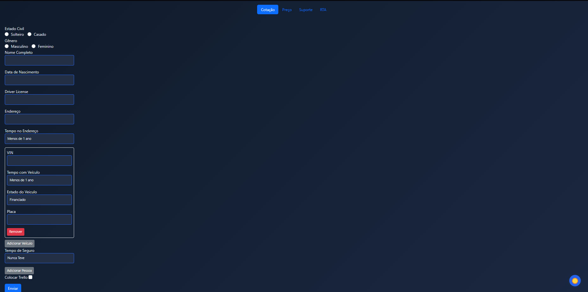
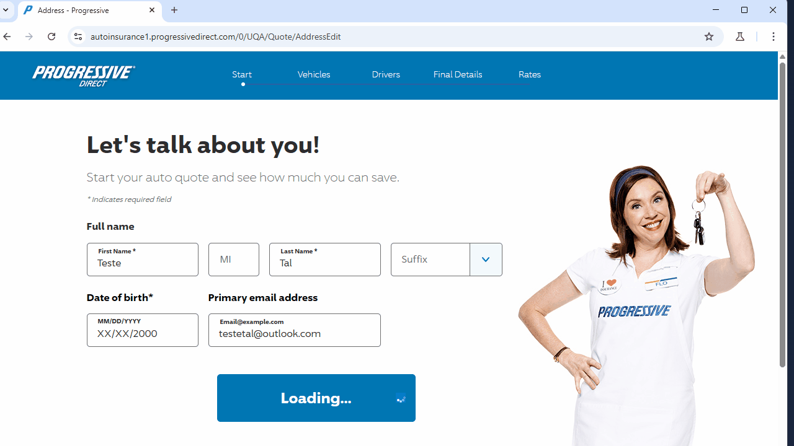
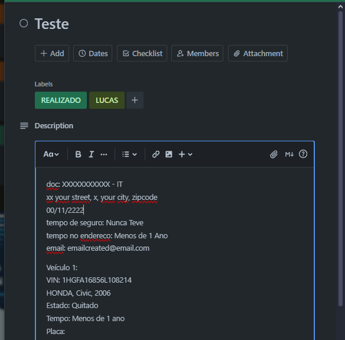

# 🚀 Auto Quotes - Automação de Cotações de Seguros


### 💡 Resumo do Projeto

O **Auto Quotes** é um sistema web completo desenvolvido para otimizar e automatizar o processo de cotação de seguros de veículos. A aplicação se integra com os portais das principais seguradoras para buscar preços em tempo real, gera um banner de resumo e organiza todo o fluxo de trabalho em um quadro do Trello.

---

### 🔥 Principais Funcionalidades

* **🤖 Automação de Cotações:** Integração via Playwright com as seguradoras **Progressive, Geico e Allstate** para preencher formulários e obter cotações automaticamente.
* **🖼️ Geração de Banners:** Criação de imagens de resumo personalizadas com os preços obtidos usando a biblioteca Pillow.
* **📋 Organização no Trello:** Envio automático da cotação e do banner gerado para um cartão específico no Trello, otimizando o fluxo de trabalho da equipe.
* **💾 Gestão de Dados:** Sistema CRUD completo (Criar, Ler, Atualizar, Deletar) para gerenciar as cotações salvas em um banco de dados SQLite.
* **✨ Interface Moderna:** Front-end responsivo, construído com um tema claro e escuro para melhor usabilidade.

---

### 🛠️ Tecnologias Utilizadas


---

### 📸 Demonstração em Ação

**1. Tela de Cadastro de Cotação**


**2. Automação com Playwright em Ação (GIF)**


**3. Banner Gerado e Cartão no Trello (Screenshot)**

---

### ⚙️ Como Rodar o Projeto

> [!NOTE]
> As instruções abaixo são para um ambiente Windows com PowerShell. Para outros sistemas, os comandos de ativação do ambiente virtual podem variar.

**1. Pré-requisitos:**
* [Python 3.10+](https://www.python.org/)
* [Git](https://git-scm.com/)

**2. Clone e configure o ambiente:**
```bash
# Clone o repositório
git clone <url-do-repositorio>
cd Auto_Quotes

# Crie e ative o ambiente virtual
python -m venv venv
.\venv\Scripts\Activate.ps1

# Instale as dependências
pip install -r requirements.txt

# Instale os navegadores para o Playwright (só na primeira vez)
playwright install